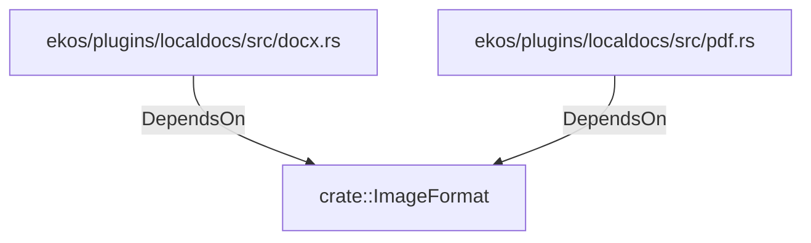

# crate::ImageFormat (RustModule)

## Properties

_No compiled properties._

## Relationships

### DependsOn

- ← ekos/plugins/localdocs/src/docx.rs (`cb8db45b-ec2c-50f2-8053-0fd63dba3355`)
- ← ekos/plugins/localdocs/src/pdf.rs (`c8cae073-dd9b-50d2-8942-335d3cdf47b3`)

## Diagram

## Evidence

_No evidence cited._
