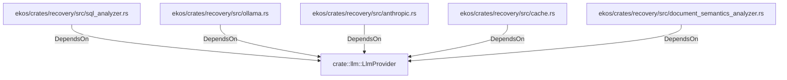

# crate::llm::LlmProvider (RustModule)

## Properties

_No compiled properties._

## Relationships

### DependsOn

- ← ekos/crates/recovery/src/sql_analyzer.rs (`cd768c5e-1640-51c3-b6ec-cb7ac78ade6d`)
- ← ekos/crates/recovery/src/ollama.rs (`952b3eaf-406f-5c22-b538-f5c2d5fbe2f9`)
- ← ekos/crates/recovery/src/anthropic.rs (`2b1d458b-2cbb-5b8a-9932-9c15c981a99e`)
- ← ekos/crates/recovery/src/cache.rs (`0b06681a-4e07-5e02-a8d6-433ccf4aadc4`)
- ← ekos/crates/recovery/src/document_semantics_analyzer.rs (`62e92526-f096-5ed2-bc72-0bdae8703aa3`)

## Diagram

## Evidence

_No evidence cited._
