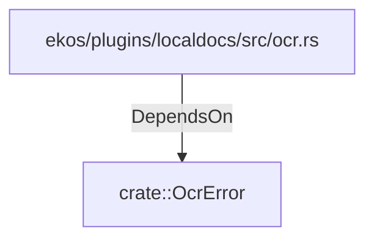

# crate::OcrError (RustModule)

## Properties

_No compiled properties._

## Relationships

### DependsOn

- ← ekos/plugins/localdocs/src/ocr.rs (`815f45c0-f388-5213-9201-2c6958a02eba`)

## Diagram

## Evidence

_No evidence cited._
