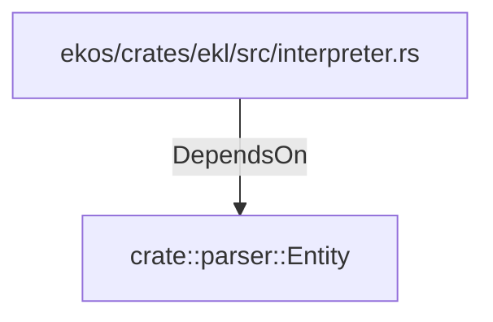

# crate::parser::Entity (RustModule)

## Properties

_No compiled properties._

## Relationships

### DependsOn

- ← ekos/crates/ekl/src/interpreter.rs (`9c2cb6e4-ee09-503f-8cf5-ccfaf23ecd79`)

## Diagram

## Evidence

_No evidence cited._
