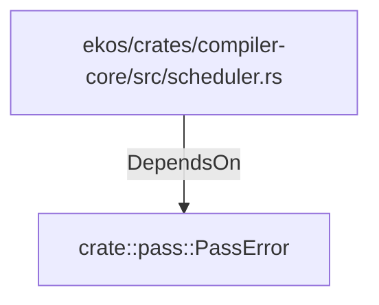

# crate::pass::PassError (RustModule)

## Properties

_No compiled properties._

## Relationships

### DependsOn

- ← ekos/crates/compiler-core/src/scheduler.rs (`973894db-35d2-59ed-b82c-30ad335125cf`)

## Diagram

## Evidence

_No evidence cited._
