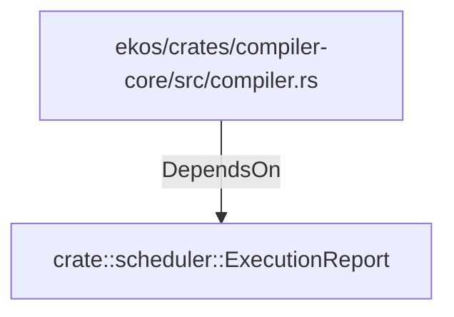

# crate::scheduler::ExecutionReport (RustModule)

## Properties

_No compiled properties._

## Relationships

### DependsOn

- ← ekos/crates/compiler-core/src/compiler.rs (`3b7209fe-32c4-588e-b8b5-5fa2165ff88b`)

## Diagram

## Evidence

_No evidence cited._
