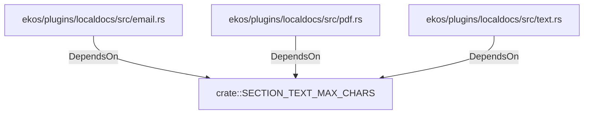

# crate::SECTION_TEXT_MAX_CHARS (RustModule)

## Properties

_No compiled properties._

## Relationships

### DependsOn

- ← ekos/plugins/localdocs/src/email.rs (`fbdd8fb1-8ac2-5e5d-b95b-c1d0451eae6e`)
- ← ekos/plugins/localdocs/src/pdf.rs (`c8cae073-dd9b-50d2-8942-335d3cdf47b3`)
- ← ekos/plugins/localdocs/src/text.rs (`fb7cfbed-8381-5078-b9d6-bc8b68af4e7d`)

## Diagram

## Evidence

_No evidence cited._
