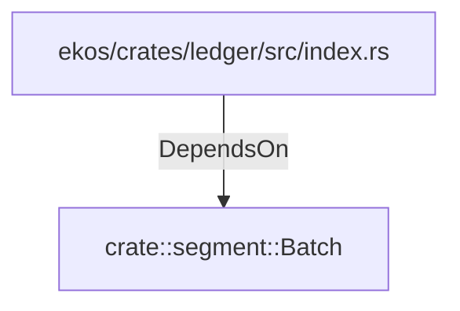

# crate::segment::Batch (RustModule)

## Properties

_No compiled properties._

## Relationships

### DependsOn

- ← ekos/crates/ledger/src/index.rs (`a43fa387-2cac-5166-bfc2-ae4c965fc2ac`)

## Diagram

## Evidence

_No evidence cited._
