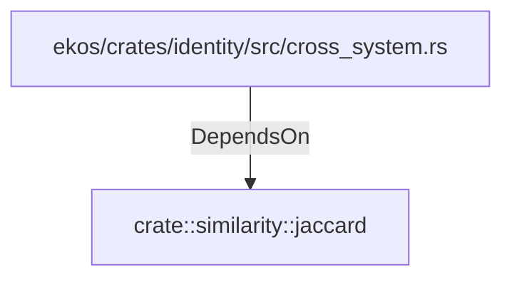

# crate::similarity::jaccard (RustModule)

## Properties

_No compiled properties._

## Relationships

### DependsOn

- ← ekos/crates/identity/src/cross_system.rs (`44d130a8-ca02-506d-bc1a-21b037fb492c`)

## Diagram

## Evidence

_No evidence cited._
