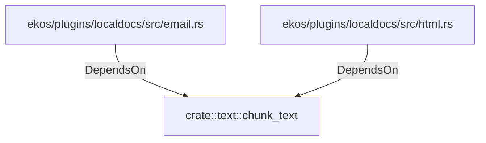

# crate::text::chunk_text (RustModule)

## Properties

_No compiled properties._

## Relationships

### DependsOn

- ← ekos/plugins/localdocs/src/email.rs (`fbdd8fb1-8ac2-5e5d-b95b-c1d0451eae6e`)
- ← ekos/plugins/localdocs/src/html.rs (`612a67f9-5373-59bf-827a-16b82d635d53`)

## Diagram

## Evidence

_No evidence cited._
