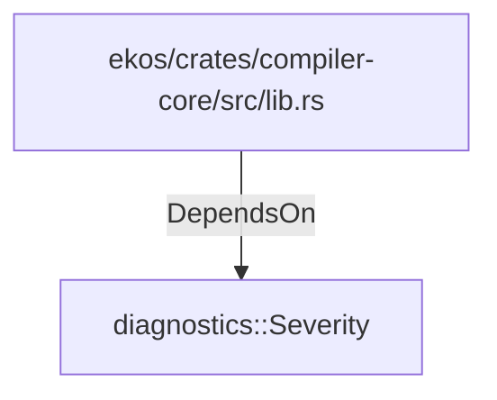

# diagnostics::Severity (RustModule)

## Properties

_No compiled properties._

## Relationships

### DependsOn

- ← ekos/crates/compiler-core/src/lib.rs (`a867fdd7-260a-509d-8907-1c5a78ba2027`)

## Diagram

## Evidence

_No evidence cited._
