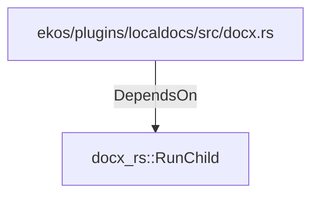

# docx_rs::RunChild (RustModule)

## Properties

_No compiled properties._

## Relationships

### DependsOn

- ← ekos/plugins/localdocs/src/docx.rs (`cb8db45b-ec2c-50f2-8053-0fd63dba3355`)

## Diagram

## Evidence

_No evidence cited._
