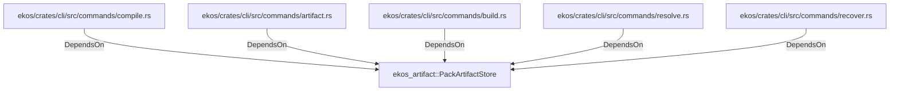

# ekos_artifact::PackArtifactStore (RustModule)

## Properties

_No compiled properties._

## Relationships

### DependsOn

- ← ekos/crates/cli/src/commands/compile.rs (`187a8810-a032-5178-ac4c-33a24e5cc42a`)
- ← ekos/crates/cli/src/commands/artifact.rs (`06db81a6-f2c1-538b-bfce-452cf905f733`)
- ← ekos/crates/cli/src/commands/build.rs (`306def2e-bd5a-5784-9453-692c119e8d43`)
- ← ekos/crates/cli/src/commands/resolve.rs (`6b6902bf-7bb5-59f8-a210-ce0acd18d7ec`)
- ← ekos/crates/cli/src/commands/recover.rs (`7e02bcf9-a7b4-5099-8255-130d9ef401bb`)

## Diagram

## Evidence

_No evidence cited._
