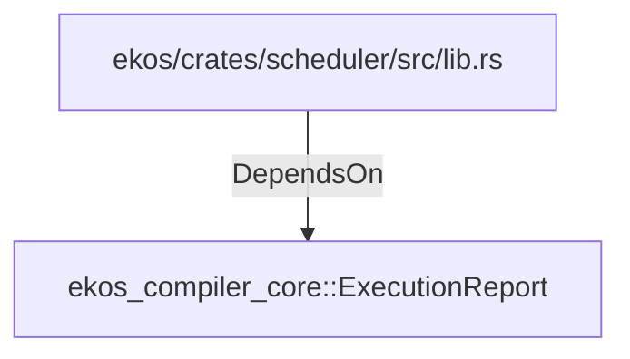

# ekos_compiler_core::ExecutionReport (RustModule)

## Properties

_No compiled properties._

## Relationships

### DependsOn

- ← ekos/crates/scheduler/src/lib.rs (`d6e2aece-dda9-583d-90e2-a8fb96cb0edb`)

## Diagram

## Evidence

_No evidence cited._
