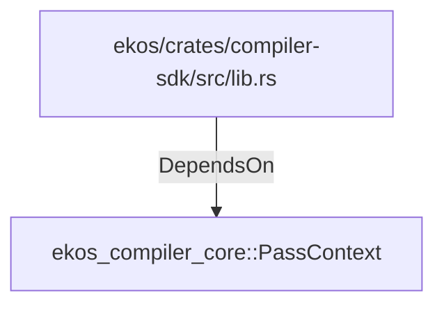

# ekos_compiler_core::PassContext (RustModule)

## Properties

_No compiled properties._

## Relationships

### DependsOn

- ← ekos/crates/compiler-sdk/src/lib.rs (`15ba2d50-0627-5c11-bb58-392e32c7913e`)

## Diagram

## Evidence

_No evidence cited._
