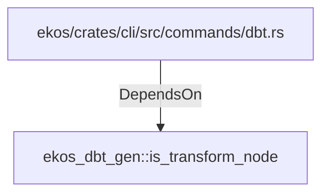

# ekos_dbt_gen::is_transform_node (RustModule)

## Properties

_No compiled properties._

## Relationships

### DependsOn

- ← ekos/crates/cli/src/commands/dbt.rs (`d3579ceb-9751-53ad-b6be-693f17509a70`)

## Diagram

## Evidence

_No evidence cited._
