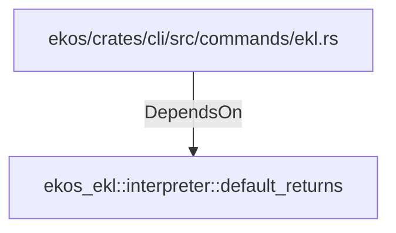

# ekos_ekl::interpreter::default_returns (RustModule)

## Properties

_No compiled properties._

## Relationships

### DependsOn

- ← ekos/crates/cli/src/commands/ekl.rs (`bc65014d-7e0a-5fdc-8a2b-fde4edce2935`)

## Diagram

## Evidence

_No evidence cited._
