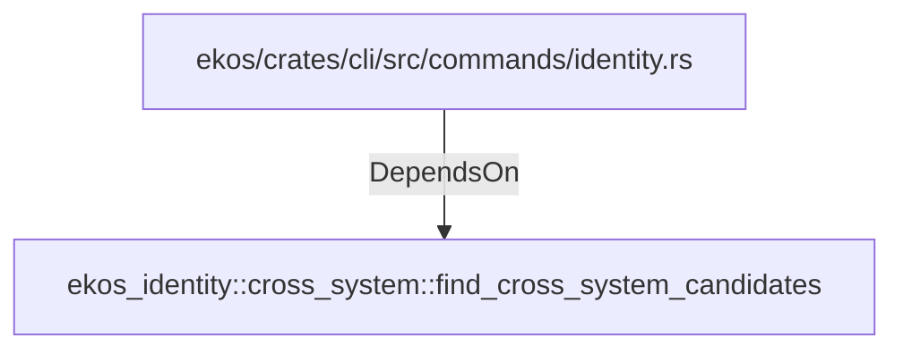

# ekos_identity::cross_system::find_cross_system_candidates (RustModule)

## Properties

_No compiled properties._

## Relationships

### DependsOn

- ← ekos/crates/cli/src/commands/identity.rs (`f6e3418b-d664-536b-8a69-b723a534ff1a`)

## Diagram

## Evidence

_No evidence cited._
