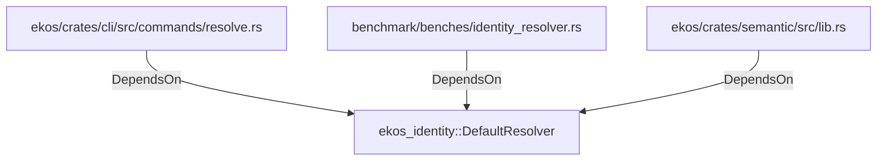

# ekos_identity::DefaultResolver (RustModule)

## Properties

_No compiled properties._

## Relationships

### DependsOn

- ← ekos/crates/cli/src/commands/resolve.rs (`6b6902bf-7bb5-59f8-a210-ce0acd18d7ec`)
- ← benchmark/benches/identity_resolver.rs (`98a76aee-0267-55e8-941f-d3a106eb2053`)
- ← ekos/crates/semantic/src/lib.rs (`54021a72-4846-550c-960f-e63303e4d103`)

## Diagram

## Evidence

_No evidence cited._
