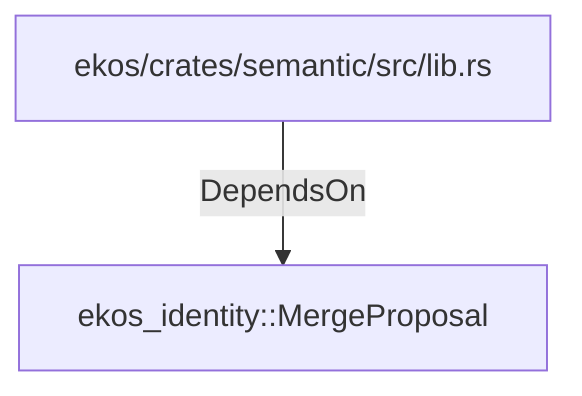

# ekos_identity::MergeProposal (RustModule)

## Properties

_No compiled properties._

## Relationships

### DependsOn

- ← ekos/crates/semantic/src/lib.rs (`54021a72-4846-550c-960f-e63303e4d103`)

## Diagram

## Evidence

_No evidence cited._
