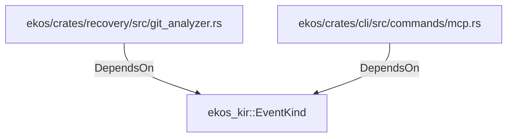

# ekos_kir::EventKind (RustModule)

## Properties

_No compiled properties._

## Relationships

### DependsOn

- ← ekos/crates/recovery/src/git_analyzer.rs (`f908320d-aaa8-525a-9521-e6581d42da30`)
- ← ekos/crates/cli/src/commands/mcp.rs (`ff76bb73-9285-5295-927c-5cb33a5bbc25`)

## Diagram

## Evidence

_No evidence cited._
