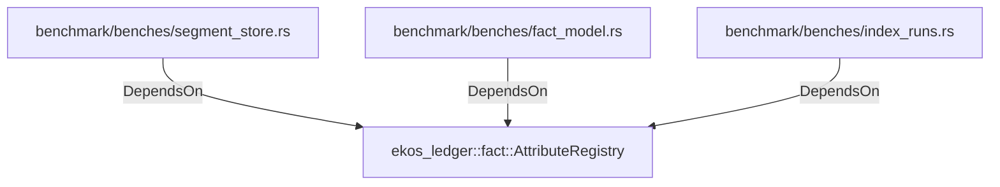

# ekos_ledger::fact::AttributeRegistry (RustModule)

## Properties

_No compiled properties._

## Relationships

### DependsOn

- ← benchmark/benches/segment_store.rs (`d038c7b7-05b2-5c5c-8f62-c4ea6f2529ee`)
- ← benchmark/benches/fact_model.rs (`8764eb55-7e1c-540c-b1d2-6545dcef6699`)
- ← benchmark/benches/index_runs.rs (`3efee357-ff49-5ace-8153-f8ad82f0cd57`)

## Diagram

## Evidence

_No evidence cited._
