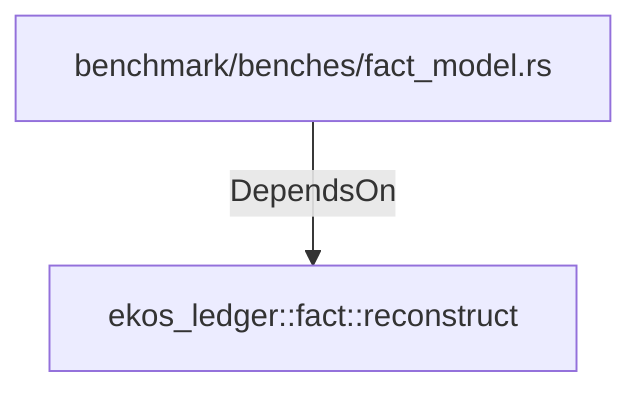

# ekos_ledger::fact::reconstruct (RustModule)

## Properties

_No compiled properties._

## Relationships

### DependsOn

- ← benchmark/benches/fact_model.rs (`8764eb55-7e1c-540c-b1d2-6545dcef6699`)

## Diagram

## Evidence

_No evidence cited._
