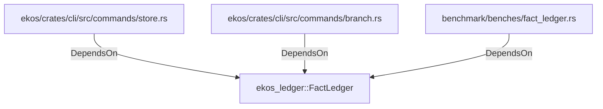

# ekos_ledger::FactLedger (RustModule)

## Properties

_No compiled properties._

## Relationships

### DependsOn

- ← ekos/crates/cli/src/commands/store.rs (`ce2ed217-2b42-5760-9d2e-e2ca1574a517`)
- ← ekos/crates/cli/src/commands/branch.rs (`8ae8543c-ebb4-545a-b5fe-5735e3953e88`)
- ← benchmark/benches/fact_ledger.rs (`51ded36f-c9b2-5f8a-97c1-43fa4d7a63a1`)

## Diagram

## Evidence

_No evidence cited._
