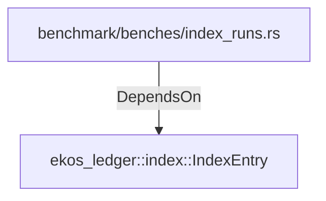

# ekos_ledger::index::IndexEntry (RustModule)

## Properties

_No compiled properties._

## Relationships

### DependsOn

- ← benchmark/benches/index_runs.rs (`3efee357-ff49-5ace-8153-f8ad82f0cd57`)

## Diagram

## Evidence

_No evidence cited._
