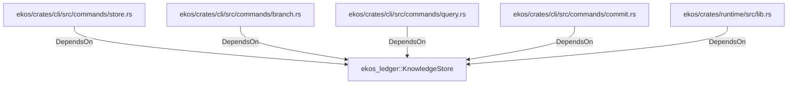

# ekos_ledger::KnowledgeStore (RustModule)

## Properties

_No compiled properties._

## Relationships

### DependsOn

- ← ekos/crates/cli/src/commands/store.rs (`ce2ed217-2b42-5760-9d2e-e2ca1574a517`)
- ← ekos/crates/cli/src/commands/branch.rs (`8ae8543c-ebb4-545a-b5fe-5735e3953e88`)
- ← ekos/crates/cli/src/commands/query.rs (`76b10d14-834f-5bcb-8858-f46092b1989c`)
- ← ekos/crates/cli/src/commands/commit.rs (`f48ae11b-a9a7-54f0-8cc6-a192b1641436`)
- ← ekos/crates/runtime/src/lib.rs (`7d8cf6bd-fac1-56d9-a742-4db7a455ab7c`)

## Diagram

## Evidence

_No evidence cited._
