# ekos_ledger::Ledger (RustModule)

## Properties

_No compiled properties._

## Relationships

### DependsOn

- ← ekos/crates/cli/src/commands/store.rs (`ce2ed217-2b42-5760-9d2e-e2ca1574a517`)
- ← ekos/crates/cli/src/commands/ledger.rs (`00bf5c8a-7198-5df3-a6eb-5bf22bc8ddcb`)
- ← tests/integration/tests/integration.rs (`23e9eb43-c8df-52b5-a581-f2efba7085ea`)
- ← benchmark/benches/runtime_load_neighborhood.rs (`ea98c002-3a2b-5dd6-9aee-01db9fa9bde1`)
- ← benchmark/benches/fact_ledger.rs (`51ded36f-c9b2-5f8a-97c1-43fa4d7a63a1`)
- ← benchmark/benches/storage_compaction.rs (`7c6dcc8e-035b-5a69-89a6-a45e962f93d8`)
- ← benchmark/benches/ledger_write.rs (`6b35bf13-a69a-59b1-8971-1df6156a8388`)

## Diagram

```mermaid
graph TD
    n773d0970f55658dd9fcfe210ef11e28d["ekos_ledger::Ledger"]
    nce2ed2172b4257609d2ee2ca1574a517["ekos/crates/cli/src/commands/store.rs"]
    nce2ed2172b4257609d2ee2ca1574a517 -->|DependsOn| n773d0970f55658dd9fcfe210ef11e28d
    n00bf5c8a71985df3a6eb5bf22bc8ddcb["ekos/crates/cli/src/commands/ledger.rs"]
    n00bf5c8a71985df3a6eb5bf22bc8ddcb -->|DependsOn| n773d0970f55658dd9fcfe210ef11e28d
    n23e9eb43c8df52b5a581f2efba7085ea["tests/integration/tests/integration.rs"]
    n23e9eb43c8df52b5a581f2efba7085ea -->|DependsOn| n773d0970f55658dd9fcfe210ef11e28d
    nea98c0023a2b5dd69aee01db9fa9bde1["benchmark/benches/runtime_load_neighborhood.rs"]
    nea98c0023a2b5dd69aee01db9fa9bde1 -->|DependsOn| n773d0970f55658dd9fcfe210ef11e28d
    n51ded36fc9b25f8a97c143fa4d7a63a1["benchmark/benches/fact_ledger.rs"]
    n51ded36fc9b25f8a97c143fa4d7a63a1 -->|DependsOn| n773d0970f55658dd9fcfe210ef11e28d
    n7c6dcc8e035b5a6989a6a45e962f93d8["benchmark/benches/storage_compaction.rs"]
    n7c6dcc8e035b5a6989a6a45e962f93d8 -->|DependsOn| n773d0970f55658dd9fcfe210ef11e28d
    n6b35bf13a69a59b189711df6156a8388["benchmark/benches/ledger_write.rs"]
    n6b35bf13a69a59b189711df6156a8388 -->|DependsOn| n773d0970f55658dd9fcfe210ef11e28d
```

## Evidence

_No evidence cited._
