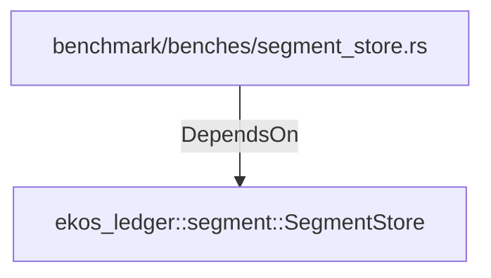

# ekos_ledger::segment::SegmentStore (RustModule)

## Properties

_No compiled properties._

## Relationships

### DependsOn

- ← benchmark/benches/segment_store.rs (`d038c7b7-05b2-5c5c-8f62-c4ea6f2529ee`)

## Diagram

## Evidence

_No evidence cited._
