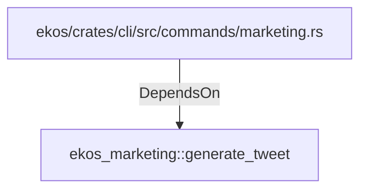

# ekos_marketing::generate_tweet (RustModule)

## Properties

_No compiled properties._

## Relationships

### DependsOn

- ← ekos/crates/cli/src/commands/marketing.rs (`e4550c2d-5dcf-5779-b25d-ac86e4019342`)

## Diagram

## Evidence

_No evidence cited._
