# ekos_observation_sdk::ScanContext (RustModule)

## Properties

_No compiled properties._

## Relationships

### DependsOn

- ← ekos/plugins/github/src/lib.rs (`85954c06-2c57-57ee-8a60-8a92c239ab70`)
- ← benchmark/benches/observation_git.rs (`ff3b4467-e5f5-5401-8b3f-2374fddfc13f`)
- ← ekos/plugins/salesforce/src/lib.rs (`62e147c2-5a91-534c-98ac-6557560db8f6`)
- ← ekos/plugins/confluence/src/lib.rs (`b78f02e6-8e4d-58de-abb4-ed29b9688c5f`)
- ← ekos/crates/cli/src/commands/build.rs (`306def2e-bd5a-5784-9453-692c119e8d43`)
- ← ekos/plugins/file/src/lib.rs (`7cdc5253-6617-5e49-81c7-9e227a76c44b`)
- ← ekos/plugins/pentaho/src/lib.rs (`cebff2b5-8142-5508-b8ad-01561647c1cc`)
- ← ekos/plugins/sap/src/lib.rs (`8ce136d7-2eb9-53fd-90c2-7d0d00aeb27d`)
- ← ekos/plugins/fabric/src/lib.rs (`ea3988ed-2565-56db-b0cf-09b6d4594525`)
- ← ekos/plugins/python/src/lib.rs (`a3158b70-7e78-5501-8593-4a22c3e9c266`)
- ← ekos/plugins/crypto/src/lib.rs (`83728c61-df4d-5ad6-81c7-5bf50ff761fb`)
- ← ekos/plugins/oracle/src/lib.rs (`affbb6cf-64eb-5dd5-805d-01cf2bd08c7f`)
- ← ekos/plugins/git/src/lib.rs (`8941bcba-6474-5c7b-af9e-97dc4f4f7a13`)
- ← ekos/plugins/snowflake/src/lib.rs (`1f09ad6b-972d-56d7-9597-8641b250abce`)
- ← ekos/plugins/rust/src/lib.rs (`1a06302f-f373-5d4e-9592-3d99844910e8`)
- ← ekos/plugins/localdocs/src/lib.rs (`1ed81bd1-9be1-5cda-9158-9ad4f1980e3d`)

## Diagram

```mermaid
graph TD
    nb2d3ec66400256dcbb5928fdc9b85b55["ekos_observation_sdk::ScanContext"]
    n85954c062c5757ee8a608a92c239ab70["ekos/plugins/github/src/lib.rs"]
    n85954c062c5757ee8a608a92c239ab70 -->|DependsOn| nb2d3ec66400256dcbb5928fdc9b85b55
    nff3b4467e5f554018b3f2374fddfc13f["benchmark/benches/observation_git.rs"]
    nff3b4467e5f554018b3f2374fddfc13f -->|DependsOn| nb2d3ec66400256dcbb5928fdc9b85b55
    n62e147c25a91534c98ac6557560db8f6["ekos/plugins/salesforce/src/lib.rs"]
    n62e147c25a91534c98ac6557560db8f6 -->|DependsOn| nb2d3ec66400256dcbb5928fdc9b85b55
    nb78f02e68e4d58deabb4ed29b9688c5f["ekos/plugins/confluence/src/lib.rs"]
    nb78f02e68e4d58deabb4ed29b9688c5f -->|DependsOn| nb2d3ec66400256dcbb5928fdc9b85b55
    n306def2ebd5a57849453692c119e8d43["ekos/crates/cli/src/commands/build.rs"]
    n306def2ebd5a57849453692c119e8d43 -->|DependsOn| nb2d3ec66400256dcbb5928fdc9b85b55
    n7cdc525366175e4981c79e227a76c44b["ekos/plugins/file/src/lib.rs"]
    n7cdc525366175e4981c79e227a76c44b -->|DependsOn| nb2d3ec66400256dcbb5928fdc9b85b55
    ncebff2b581425508b8ad01561647c1cc["ekos/plugins/pentaho/src/lib.rs"]
    ncebff2b581425508b8ad01561647c1cc -->|DependsOn| nb2d3ec66400256dcbb5928fdc9b85b55
    n8ce136d72eb953fd90c27d0d00aeb27d["ekos/plugins/sap/src/lib.rs"]
    n8ce136d72eb953fd90c27d0d00aeb27d -->|DependsOn| nb2d3ec66400256dcbb5928fdc9b85b55
    nea3988ed256556dbb0cf09b6d4594525["ekos/plugins/fabric/src/lib.rs"]
    nea3988ed256556dbb0cf09b6d4594525 -->|DependsOn| nb2d3ec66400256dcbb5928fdc9b85b55
    na3158b707e78550185934a22c3e9c266["ekos/plugins/python/src/lib.rs"]
    na3158b707e78550185934a22c3e9c266 -->|DependsOn| nb2d3ec66400256dcbb5928fdc9b85b55
    n83728c61df4d5ad681c75bf50ff761fb["ekos/plugins/crypto/src/lib.rs"]
    n83728c61df4d5ad681c75bf50ff761fb -->|DependsOn| nb2d3ec66400256dcbb5928fdc9b85b55
    naffbb6cf64eb5dd5805d01cf2bd08c7f["ekos/plugins/oracle/src/lib.rs"]
    naffbb6cf64eb5dd5805d01cf2bd08c7f -->|DependsOn| nb2d3ec66400256dcbb5928fdc9b85b55
    n8941bcba64745c7baf9e97dc4f4f7a13["ekos/plugins/git/src/lib.rs"]
    n8941bcba64745c7baf9e97dc4f4f7a13 -->|DependsOn| nb2d3ec66400256dcbb5928fdc9b85b55
    n1f09ad6b972d56d795978641b250abce["ekos/plugins/snowflake/src/lib.rs"]
    n1f09ad6b972d56d795978641b250abce -->|DependsOn| nb2d3ec66400256dcbb5928fdc9b85b55
    n1a06302ff3735d4e95923d99844910e8["ekos/plugins/rust/src/lib.rs"]
    n1a06302ff3735d4e95923d99844910e8 -->|DependsOn| nb2d3ec66400256dcbb5928fdc9b85b55
    n1ed81bd19be15cda91589ad4f1980e3d["ekos/plugins/localdocs/src/lib.rs"]
    n1ed81bd19be15cda91589ad4f1980e3d -->|DependsOn| nb2d3ec66400256dcbb5928fdc9b85b55
```

## Evidence

_No evidence cited._
