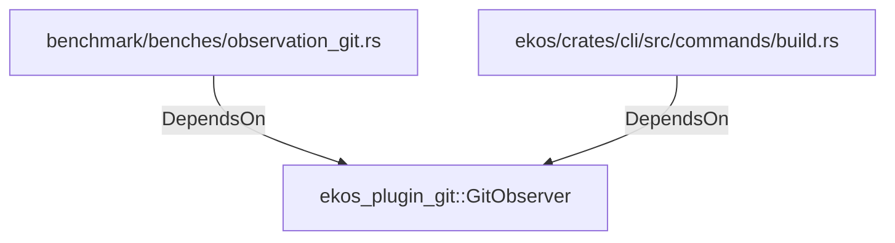

# ekos_plugin_git::GitObserver (RustModule)

## Properties

_No compiled properties._

## Relationships

### DependsOn

- ← benchmark/benches/observation_git.rs (`ff3b4467-e5f5-5401-8b3f-2374fddfc13f`)
- ← ekos/crates/cli/src/commands/build.rs (`306def2e-bd5a-5784-9453-692c119e8d43`)

## Diagram

## Evidence

_No evidence cited._
