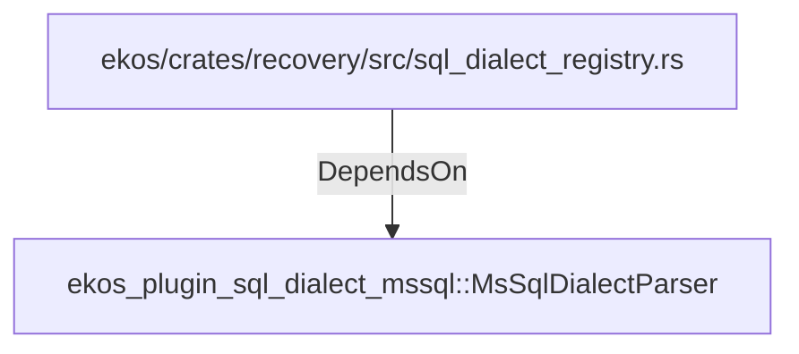

# ekos_plugin_sql_dialect_mssql::MsSqlDialectParser (RustModule)

## Properties

_No compiled properties._

## Relationships

### DependsOn

- ← ekos/crates/recovery/src/sql_dialect_registry.rs (`6e4ae0e1-9d1b-562a-a409-406a2ee0181a`)

## Diagram

## Evidence

_No evidence cited._
