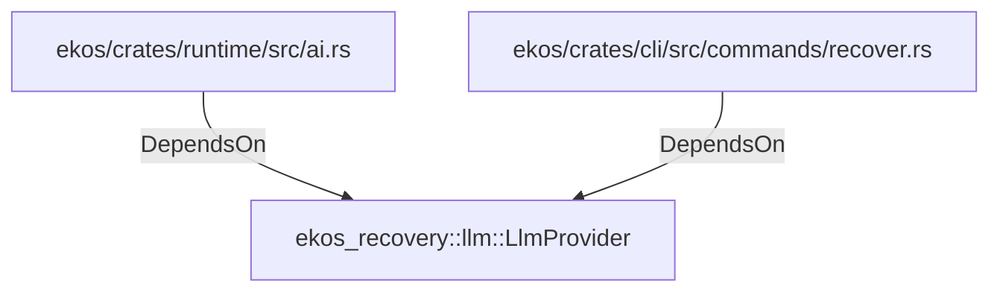

# ekos_recovery::llm::LlmProvider (RustModule)

## Properties

_No compiled properties._

## Relationships

### DependsOn

- ← ekos/crates/runtime/src/ai.rs (`e85e734d-ef58-5185-835a-34896d2da3f1`)
- ← ekos/crates/cli/src/commands/recover.rs (`7e02bcf9-a7b4-5099-8255-130d9ef401bb`)

## Diagram

## Evidence

_No evidence cited._
