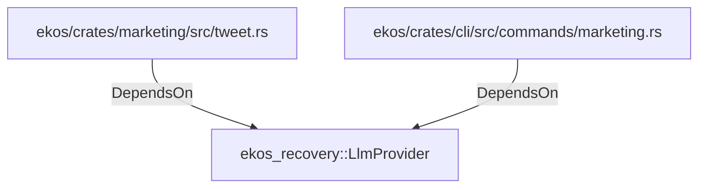

# ekos_recovery::LlmProvider (RustModule)

## Properties

_No compiled properties._

## Relationships

### DependsOn

- ← ekos/crates/marketing/src/tweet.rs (`3372ee6e-2a1d-50b2-a3ae-b17eb421301b`)
- ← ekos/crates/cli/src/commands/marketing.rs (`e4550c2d-5dcf-5779-b25d-ac86e4019342`)

## Diagram

## Evidence

_No evidence cited._
