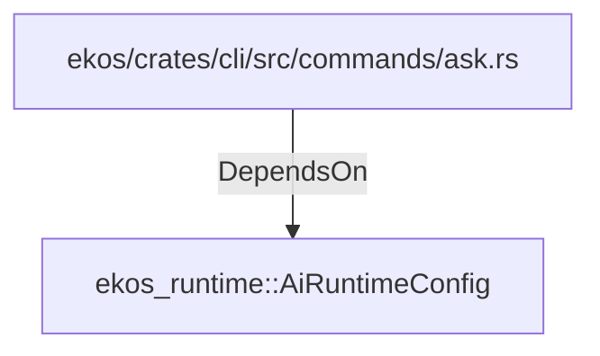

# ekos_runtime::AiRuntimeConfig (RustModule)

## Properties

_No compiled properties._

## Relationships

### DependsOn

- ← ekos/crates/cli/src/commands/ask.rs (`e7e75efa-39cb-5182-b056-2fd16dfdc739`)

## Diagram

## Evidence

_No evidence cited._
