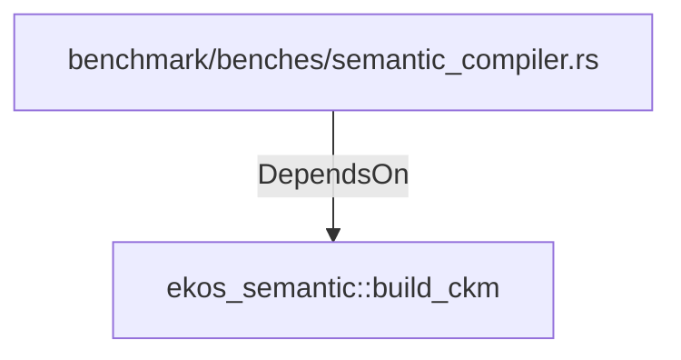

# ekos_semantic::build_ckm (RustModule)

## Properties

_No compiled properties._

## Relationships

### DependsOn

- ← benchmark/benches/semantic_compiler.rs (`95222458-b6a4-5b9c-bcc9-0e2e1909eb44`)

## Diagram

## Evidence

_No evidence cited._
