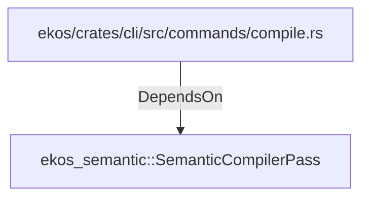

# ekos_semantic::SemanticCompilerPass (RustModule)

## Properties

_No compiled properties._

## Relationships

### DependsOn

- ← ekos/crates/cli/src/commands/compile.rs (`187a8810-a032-5178-ac4c-33a24e5cc42a`)

## Diagram

## Evidence

_No evidence cited._
