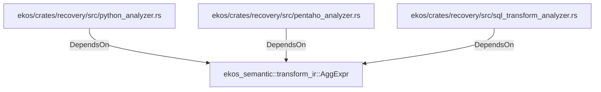

# ekos_semantic::transform_ir::AggExpr (RustModule)

## Properties

_No compiled properties._

## Relationships

### DependsOn

- ← ekos/crates/recovery/src/python_analyzer.rs (`196ca3fd-e85c-5ab9-a142-50f63dc586b9`)
- ← ekos/crates/recovery/src/pentaho_analyzer.rs (`ce3d2f1b-e1c6-55d7-92bc-c1b69f76dbca`)
- ← ekos/crates/recovery/src/sql_transform_analyzer.rs (`987e3fbb-31ec-576d-b794-7e801336e8c8`)

## Diagram

## Evidence

_No evidence cited._
