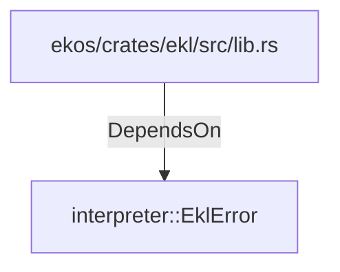

# interpreter::EklError (RustModule)

## Properties

_No compiled properties._

## Relationships

### DependsOn

- ← ekos/crates/ekl/src/lib.rs (`848e7f03-56a8-5a5e-a25b-1423213f9e42`)

## Diagram

## Evidence

_No evidence cited._
