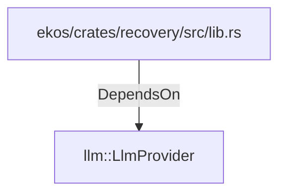

# llm::LlmProvider (RustModule)

## Properties

_No compiled properties._

## Relationships

### DependsOn

- ← ekos/crates/recovery/src/lib.rs (`ee68c875-431a-504b-aa03-2598fdfeb0d9`)

## Diagram

## Evidence

_No evidence cited._
