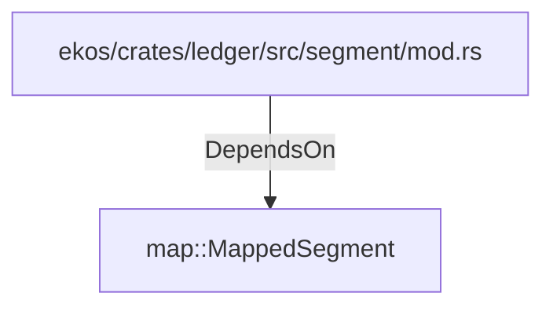

# map::MappedSegment (RustModule)

## Properties

_No compiled properties._

## Relationships

### DependsOn

- ← ekos/crates/ledger/src/segment/mod.rs (`80a64e0a-b0ac-51df-b3be-128cddd1cc83`)

## Diagram

## Evidence

_No evidence cited._
