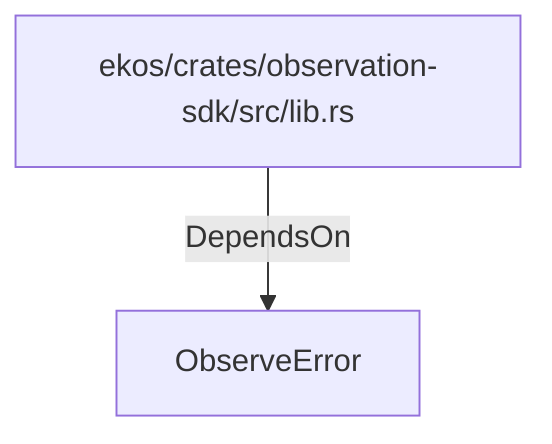

# ObserveError (RustModule)

## Properties

_No compiled properties._

## Relationships

### DependsOn

- ← ekos/crates/observation-sdk/src/lib.rs (`66ce958b-7250-5ec2-954e-eacf8f64aae0`)

## Diagram

## Evidence

_No evidence cited._
