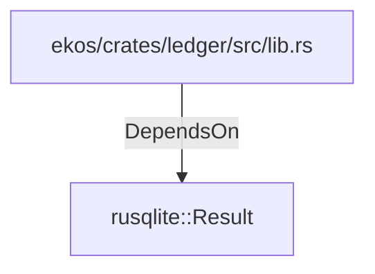

# rusqlite::Result (RustModule)

## Properties

_No compiled properties._

## Relationships

### DependsOn

- ← ekos/crates/ledger/src/lib.rs (`21938f45-b767-5933-9e71-12e15ff53eb1`)

## Diagram

## Evidence

_No evidence cited._
