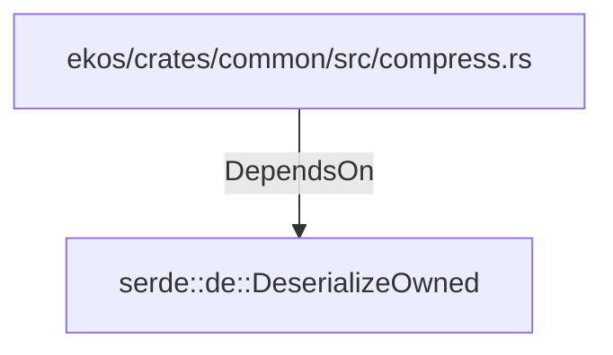

# serde::de::DeserializeOwned (RustModule)

## Properties

_No compiled properties._

## Relationships

### DependsOn

- ← ekos/crates/common/src/compress.rs (`99637da4-0489-5fca-ba15-b1144f48c3cc`)

## Diagram

## Evidence

_No evidence cited._
