# sha2::Sha256 (RustModule)

## Properties

_No compiled properties._

## Relationships

### DependsOn

- ← ekos/crates/common/src/lib.rs (`baf41b7a-1ef7-5a05-9152-5eb0218f0896`)
- ← ekos/crates/ledger/src/segment/mod.rs (`80a64e0a-b0ac-51df-b3be-128cddd1cc83`)
- ← ekos/plugins/file/src/lib.rs (`7cdc5253-6617-5e49-81c7-9e227a76c44b`)
- ← ekos/plugins/pentaho/src/lib.rs (`cebff2b5-8142-5508-b8ad-01561647c1cc`)
- ← ekos/plugins/python/src/lib.rs (`a3158b70-7e78-5501-8593-4a22c3e9c266`)
- ← ekos/plugins/rust/src/lib.rs (`1a06302f-f373-5d4e-9592-3d99844910e8`)
- ← ekos/crates/recovery/src/cache.rs (`0b06681a-4e07-5e02-a8d6-433ccf4aadc4`)
- ← ekos/crates/artifact/src/lib.rs (`918532b1-7390-5128-8de5-faf4f7a91daf`)
- ← ekos/plugins/localdocs/src/lib.rs (`1ed81bd1-9be1-5cda-9158-9ad4f1980e3d`)

## Diagram

```mermaid
graph TD
    nbbc7b027e455596bbd5efe533126d557["sha2::Sha256"]
    nbaf41b7a1ef75a0591525eb0218f0896["ekos/crates/common/src/lib.rs"]
    nbaf41b7a1ef75a0591525eb0218f0896 -->|DependsOn| nbbc7b027e455596bbd5efe533126d557
    n80a64e0ab0ac51dfb3be128cddd1cc83["ekos/crates/ledger/src/segment/mod.rs"]
    n80a64e0ab0ac51dfb3be128cddd1cc83 -->|DependsOn| nbbc7b027e455596bbd5efe533126d557
    n7cdc525366175e4981c79e227a76c44b["ekos/plugins/file/src/lib.rs"]
    n7cdc525366175e4981c79e227a76c44b -->|DependsOn| nbbc7b027e455596bbd5efe533126d557
    ncebff2b581425508b8ad01561647c1cc["ekos/plugins/pentaho/src/lib.rs"]
    ncebff2b581425508b8ad01561647c1cc -->|DependsOn| nbbc7b027e455596bbd5efe533126d557
    na3158b707e78550185934a22c3e9c266["ekos/plugins/python/src/lib.rs"]
    na3158b707e78550185934a22c3e9c266 -->|DependsOn| nbbc7b027e455596bbd5efe533126d557
    n1a06302ff3735d4e95923d99844910e8["ekos/plugins/rust/src/lib.rs"]
    n1a06302ff3735d4e95923d99844910e8 -->|DependsOn| nbbc7b027e455596bbd5efe533126d557
    n0b06681a4e075e02a8d6433ccf4aadc4["ekos/crates/recovery/src/cache.rs"]
    n0b06681a4e075e02a8d6433ccf4aadc4 -->|DependsOn| nbbc7b027e455596bbd5efe533126d557
    n918532b1739051288de5faf4f7a91daf["ekos/crates/artifact/src/lib.rs"]
    n918532b1739051288de5faf4f7a91daf -->|DependsOn| nbbc7b027e455596bbd5efe533126d557
    n1ed81bd19be15cda91589ad4f1980e3d["ekos/plugins/localdocs/src/lib.rs"]
    n1ed81bd19be15cda91589ad4f1980e3d -->|DependsOn| nbbc7b027e455596bbd5efe533126d557
```

## Evidence

_No evidence cited._
