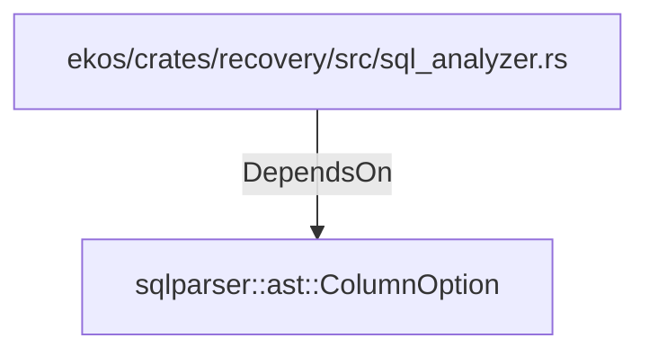

# sqlparser::ast::ColumnOption (RustModule)

## Properties

_No compiled properties._

## Relationships

### DependsOn

- ← ekos/crates/recovery/src/sql_analyzer.rs (`cd768c5e-1640-51c3-b6ec-cb7ac78ade6d`)

## Diagram

## Evidence

_No evidence cited._
