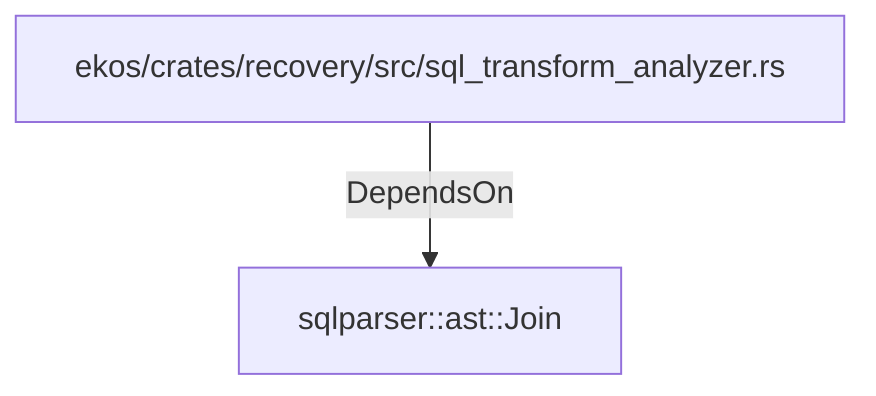

# sqlparser::ast::Join (RustModule)

## Properties

_No compiled properties._

## Relationships

### DependsOn

- ← ekos/crates/recovery/src/sql_transform_analyzer.rs (`987e3fbb-31ec-576d-b794-7e801336e8c8`)

## Diagram

## Evidence

_No evidence cited._
