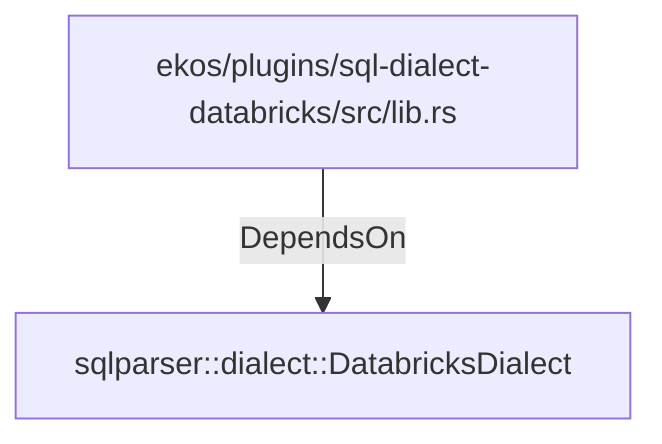

# sqlparser::dialect::DatabricksDialect (RustModule)

## Properties

_No compiled properties._

## Relationships

### DependsOn

- ← ekos/plugins/sql-dialect-databricks/src/lib.rs (`e03746a2-2ca7-57cf-abcf-b40da11fd1d4`)

## Diagram

## Evidence

_No evidence cited._
