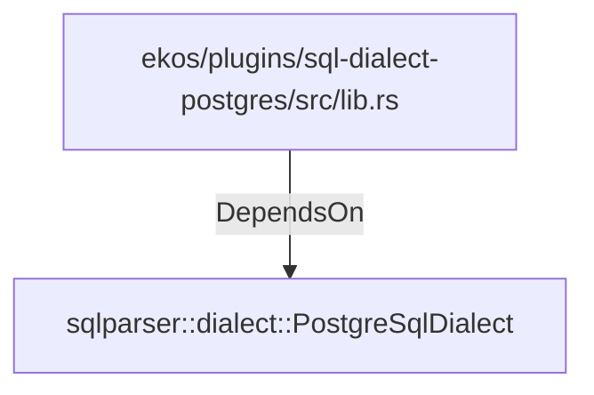

# sqlparser::dialect::PostgreSqlDialect (RustModule)

## Properties

_No compiled properties._

## Relationships

### DependsOn

- ← ekos/plugins/sql-dialect-postgres/src/lib.rs (`4635063b-44e9-5cfb-97e8-4e39451ffe73`)

## Diagram

## Evidence

_No evidence cited._
