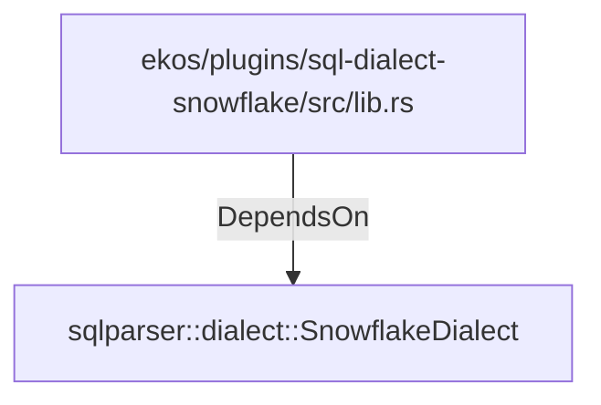

# sqlparser::dialect::SnowflakeDialect (RustModule)

## Properties

_No compiled properties._

## Relationships

### DependsOn

- ← ekos/plugins/sql-dialect-snowflake/src/lib.rs (`0417a4c7-1d0b-52f5-b2de-f52571e9dc2b`)

## Diagram

## Evidence

_No evidence cited._
